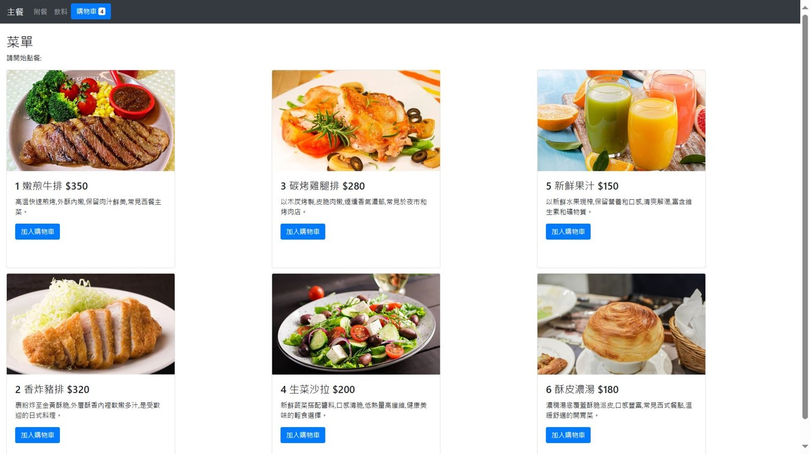
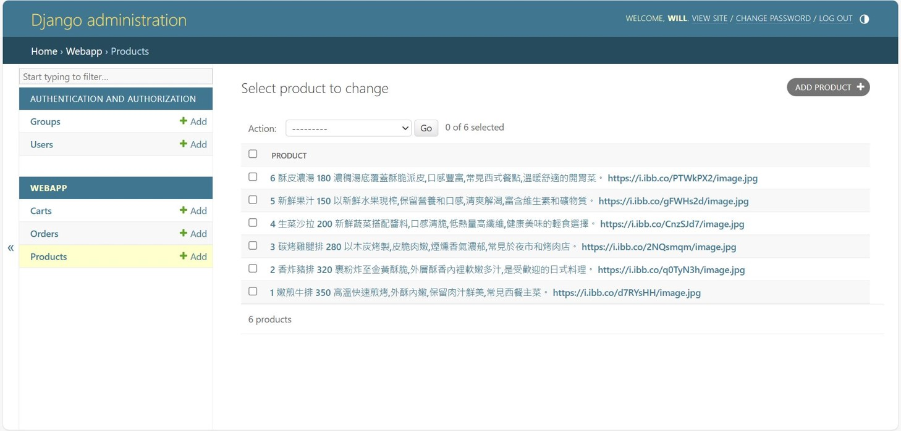
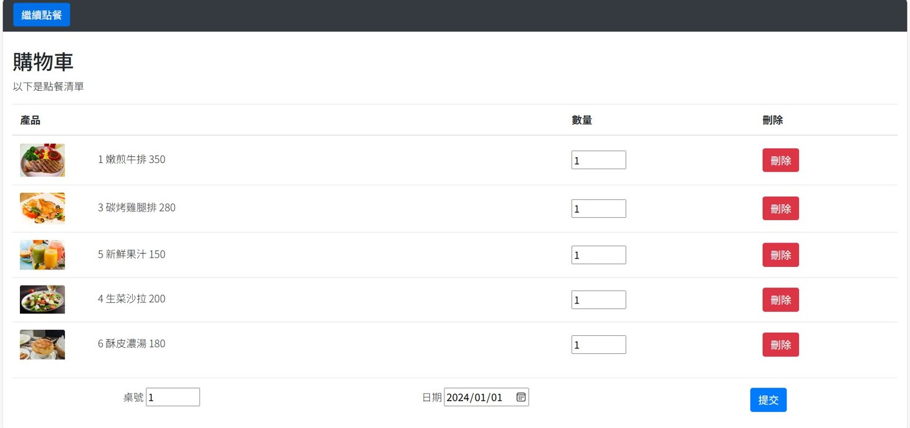

# Django 餐廳點餐系統

使用 Django 框架建構的網路餐廳點餐系統，讓顧客可以瀏覽菜單項目、加入購物車並提交訂單。

## 前台點餐畫面


## 後台畫面


## 購物車畫面


## 使用技術

### 後端
- Django
- Python


### 前端
- HTML
- JavaScript/jQuery
- Bootstrap

---

## 功能特點

### 菜單頁面
- 顯示含有圖片、標題、描述和價格的菜單項目。
- 使用 Bootstrap 的響應式卡片佈局。
- 將項目加入購物車。
- 即時購物車項目計數器。
- 成功加入購物車時的 Toast 通知。

### 購物車
- 檢視所有購物車項目。
- 調整項目數量。
- 移除項目。
- 提交訂單（含桌號和日期選擇）。
- 繼續購物按鈕。

### 管理介面
- 內建 Django 管理面板。
- 管理菜單項目（CRUD 操作）。
- 檢視和管理訂單。
- 使用者管理。

---

## 專案結構

Django 的 MVC（Model-View-Controller）架構：

### 模型（models.py）
- **Product**：菜單項目模型，包含標題、價格、描述和圖片 URL 欄位。
- **Cart**：購物車模型，包含產品外鍵和數量。
- **Order**：訂單模型，包含日期、桌號、產品參考和數量。

### 視圖（views.py）
- `menu`：顯示菜單項目和購物車數量。
- `cart`：顯示當前購物車項目。
- `submit_cart`：處理將項目加入購物車。
- `del_cart`：從購物車移除項目。
- `submit_order`：處理最終訂單提交。

### 模板
- `menu.html`：含商品的菜單頁面。
- `cart.html`：購物車介面。
- `index.html`：首頁。

### 網址配置（urls.py）
```Python
urlpatterns = [
    path('', views.menu, name='index'),
    path('menu/', views.menu, name='menu'),
    path('cart/', views.cart, name='cart'),
    path('del_cart/', views.del_cart, name='del_cart'),
    path('submit_cart/', views.submit_cart, name='submit_cart'),
    path('submit_order/', views.submit_order, name='submit_order'),
]
```

### 安裝說明
- 複製專案儲存庫
- 建立並啟動環境
- 執行資料庫遷移：
```bash
python manage.py makemigrations webapp
python manage.py migrate
```

- 建立超級使用者：
```bash
python manage.py createsuperuser
```

- 啟動伺服器：
```bash
python manage.py runserver
```

- 存取管理面板：http://127.0.0.1:8000/admin/
